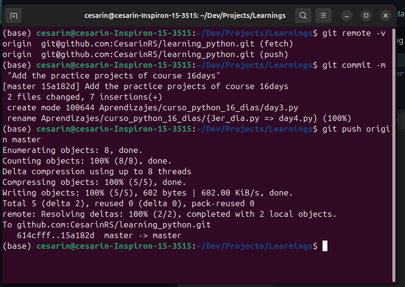
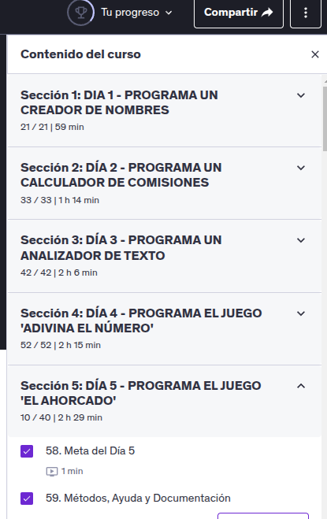
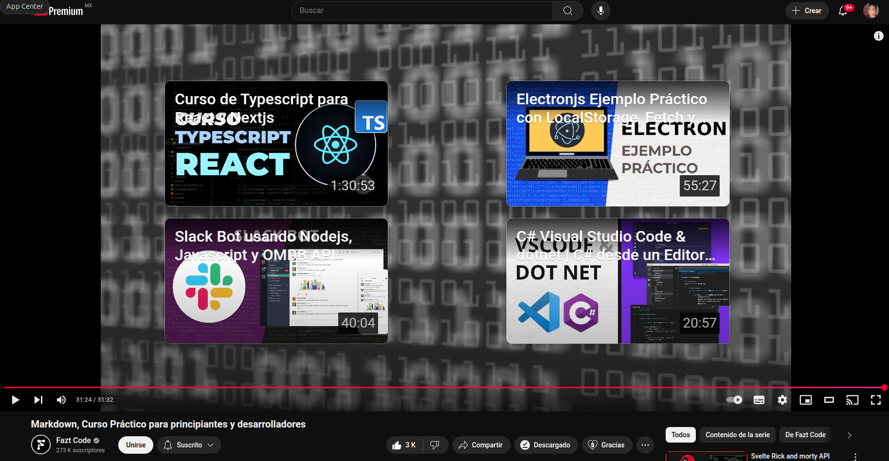

# learnings

## First week (February 24, 2025)
- I complete the python course from day 2 to day 5.
- 6 hours of course plus practices
- Reinforcement of basics (Data types, loops, flow control, etc.)
- Markdown mini course (30 min)
- English practice: Watched a 12 episode series, 24 minutes per episode.

### Screenshots of learnings
* git push course day3, day4 and day5

* Advance of python course

* Markdown mini course 

### Expected Learning Outcomes:
1. Advance to day 8 of the 16days course
   * Day 5 (2hrs:29min) 
   * Day 6 (2hrs:18min)
   * Day 7 (1hr:51min)
   * Day 8 (1hr:50min)
2. Start django course (Already purchased)
   * Start and finish section 2/6 (2hrs:44min)
3. Another 10 - 12 chapters in English + notes.
4. Github course (To be purchased for valid certification)

